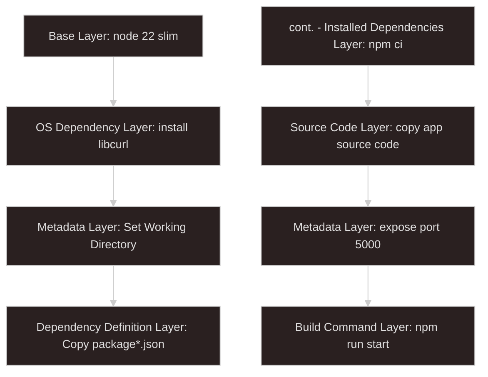
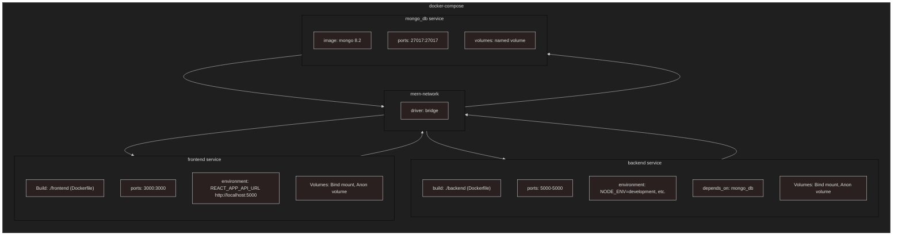
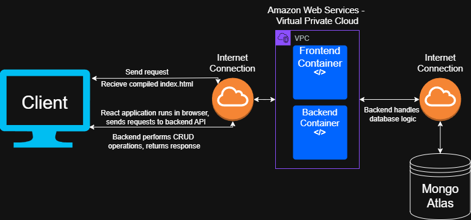
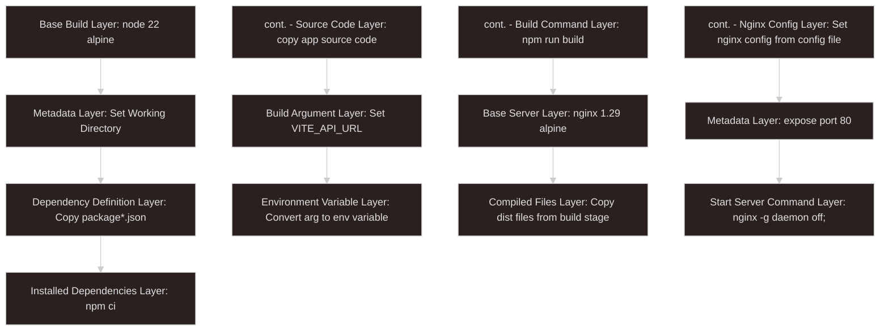
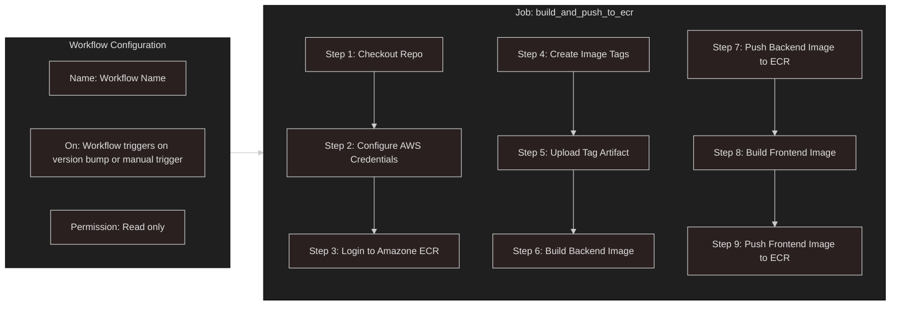
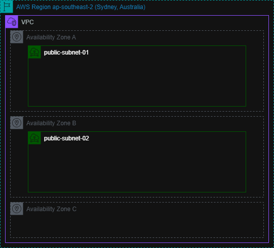
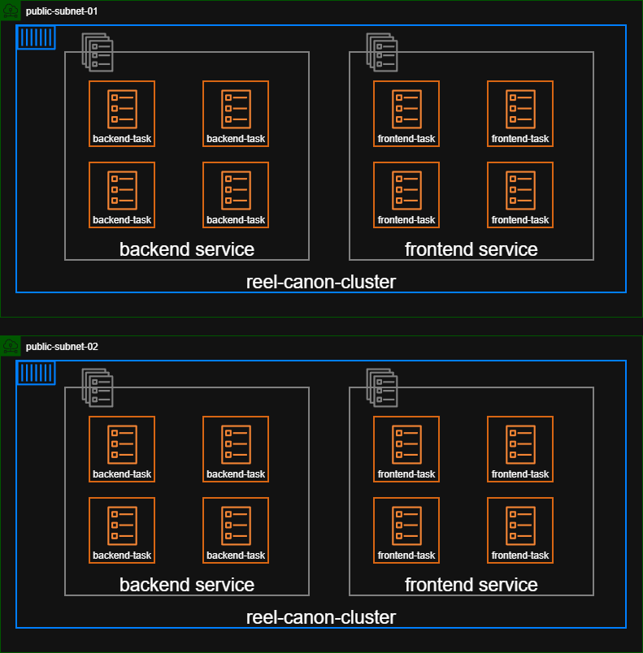
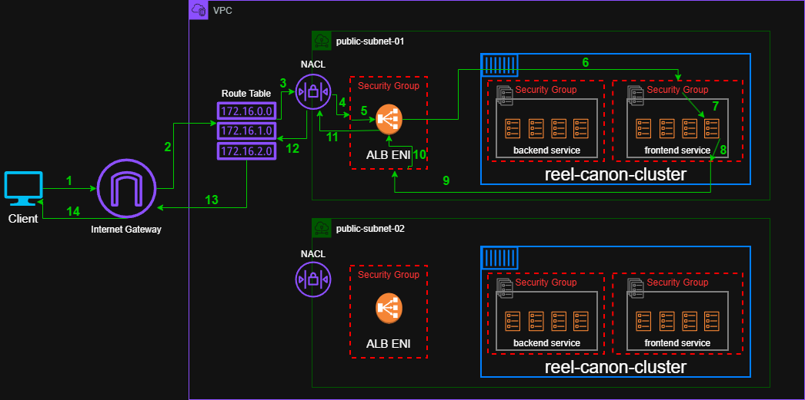
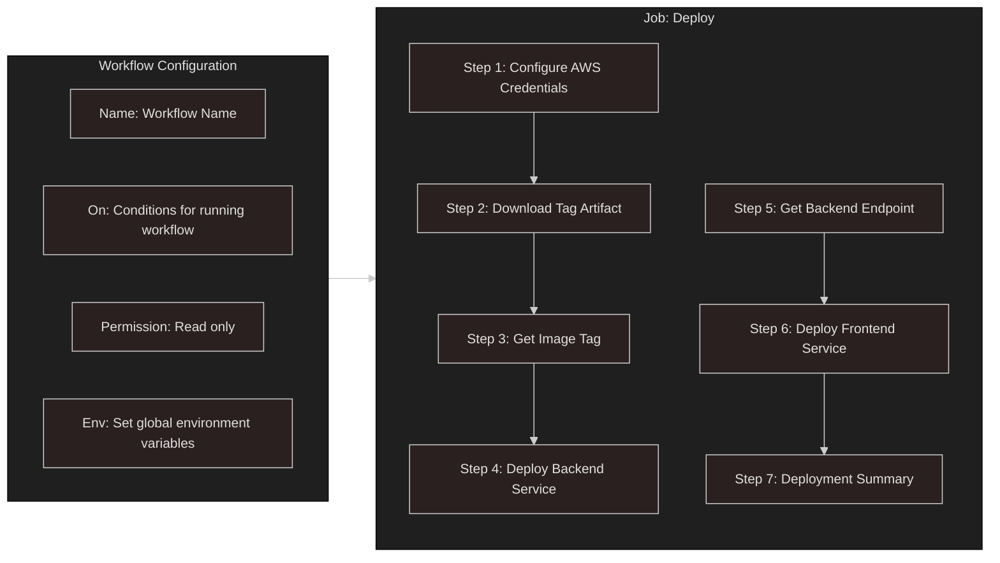

# Planning a Multi Container Application

## Overview

This project tackles converting my previously completed [full stack mern application](https://github.com/CoderAcademy-DEV-MERN-Group) into a multi container application. The project will utilize build files to containerize the application for three separate environments - development, production and test.

Github Actions workflows will also be utilized to automate:

- Building the application in test containers and running tests
- Building production ready container images, semantically tagging them, and pushing them to AWS ECR
- Deploying the production containers to AWS ECS
- Utilizing secrets to safely store and inject sensitive environment variables

## Development Environment

The development environment will split the application into three containers - frontend, backend and database. Dockerfile's will be used in the frontend and the backend as build files, while a [docker-compose](./docker-compose.yaml) file will be used in the repository root, building the frontend and backend services from their build files while specifying port mapping, environment variables, volumes and networks. The compose file will also contain instructions to pull the official MongoDB image from Docker Hub, using it to build the database service.

Lets review the following diagram of the planned backend Dockerfile and break down each layer:

- **Base Layer:** This is the layer upon which all the other image layers are built. Since the backend requires a node environment, we will use the node image, with a specific compatible version used for stability rather than using latest and risking breaking changes. The slim variant will be used, as it is more lightweight than the full-sized node image, while still containing bash and curl as useful debugging tools, missing in the alpine version.
- **OS Dependency Layer:** Not necessary for the development environment, but used for the test environment, since the backend requires only a single Dockerfile compatible across all three environments. As a very lightweight additional dependency, creating a separate Dockerfile just for test containerization will not be necessary.
- **Metadata Layer:** This creates an application working directory in the container file system, become the default file location for all Dockerfile instructions from this point. This is standard industry practice, as leaving application files in the root container directory can cause unexpected issues.
- **Dependency Definition Layer:** Creating a separate layer for dependency definition files rather than including them in application source code prevents the container from rebuilding dependency files when the application source code is changed, but dependency definition files aren't. This enables faster 'hot reloading' and a more efficient usage of resources.
- **Installed Dependency Files:** This layer contains the installed packages (node_modules). The `npm ci` (clean install) command is more appropriate for containerization, as it does a fresh install of node_modules, installing dependencies exactly as specified in package-lock.json, and runs faster in container environments
- **Source Code Layer:** Install the application source code files, excluding already installed package files, and any files specified in the `.dockerignore` file. The ignore file will include docs, IDE config files, environment files, git files, logs, etc.
- **Metadata Layer:** The line `EXPOSE 5000` does not actually expose port 5000, it just includes metadata in the image that the container intends to listen on port 5000. This is standard convention as documentation, and also improves compatibility with some tools.
- **Build Command Layer:** We will use `npm run start` as the run command in this file, even though that is not the run command used for the development environment. As mentioned prior, this Dockerfile is for all three environments, so we will use the production run command in the Dockerfile, which is overwritten by the 'command' argument in the docker-compose.yaml with `npm run dev`

There are two Dockerfile's for the frontend service, one that covers dev and test environments, and a `Dockerfile.prod` for production environment. The dev Dockerfile is identical apart from 3 changes:

- No need to install libcurl
- Expose port 3000 instead of 5000
- Command `npm run dev` as we have separate production Dockerfile

Moving onto the docker-compose file. Lets have a look at the overall flow:

Breaking this into the three top level arguments, we will use services, networks and volumes.

### Services

These are the containers defined in the docker-compose file, responsible for running the application

#### Backend Service

- **Build:** Refers to the location of the build file (Dockerfile), and service source code.
- **Container_Name:** Not necessary, but provides an easy to reference, custom service name.
- **Command:** This overwrites the 'CMD' argument in the Dockerfile. `npm run dev` will be used to start the backend development server when the backend service is started.
- **Ports:** The syntax for port mapping is 'host port' -> 'container port'. By default, when a container is listening on a port (5000 in this case), that port can only be accessed within that container, or by other containers within the same defined (not default) bridge network. By mapping the container port to the host (machine) port, docker forwards traffic from the host port to the mapped container port. For the backend service, we will map 5000 to 5000, which is not needed and is less secure, but is appropriate to provide debugging and direct interaction within a development environment.
- **Environment:** There are multiple ways to pass sensitive environment variables to services in a compose file. Using the 'environment' argument with a root level `.env` file allows us to pass sensitive variables using the `${}` syntax, e.g. `JWT_SECRET_KEY=${JWT_SECRET_KEY}`
- **Depends_On:** This argument does not effect build order, but does effect run order. In this compose file, the backend service depends on the mongo_db service. This means that the backend service cannot run until the mongo_db service is running, preventing connection issues when the service runs and connects to the database.
- **Volumes:** We will use two volumes for the backend service, a bind mount and an anonymous volume. The bind mount will mount the backend folder on the host machine to the containers '/app' directory. This causes changes to the files on the host machine to be reflected within the container files, ideal for 'hot reloading' in a development environment. An anonymous volume is a docker created and managed volume that exists isolated from the host machine, which persists when a container stops but is removed when all associated containers are deleted. This makes it ideal for storing the node_modules folder, allowing dependency files to persist between container starting and stopping and be removed upon container removal. It also ensures dependencies are created fresh and isolated within the container, without contamination from the host machine, as dependencies can be built differently depending on the underlying host.
- **Networks:** A bridge network named 'mern-network' will be used to network all three services, ensuring they can access each others container ports regardless of if the ports are mapped or not.

#### Frontend Service

The frontend service will composed identically to the backend service apart from the following differences:

- Port will be mapped as 3000:3000
- No command override
- Different environment variables passed in
- Does not depend on mongo_db service

#### MongoDB Service

- **Image:** As this is built from an official Docker Image rather than a local build file, it will use the mongo:8.2 image and tag, for the latest stable and compatible version
- **Ports:** The container will expose port 27017. This is not necessary for app functionality thanks to the bridge network, but it will allow database debugging for the development environment
- **Volumes:** This service will use a named volume. Unlike an anonymous volume that is removed when disassociated with any containers, a named volume will persist regardless. The volume is isolated from the host machine and is managed by Docker, but the file path is specified by the user. Data is also easier to inspect using the `docker inspect` command. For these reasons, a named volume is most appropriate as use for containerized database storage.
- **Networks:** This service will share the 'mern-network', allowing inter-container communication regardless of port exposure

### Networks

As previously mentioned, bridge networks in docker allow inter-container communication without exposing ports externally. This allows for for having a public facing frontend service, while a backend and database service can only communicate with containers within the network. Although docker containers run by default in a bridge network, this default network does not allow inter-container communication.

### Volumes

Similar to the elastic block store providing persistent storage for EC2 instances in AWS, named volumes can be defined at the top level of a compose file to provide isolated docker managed storage that persists container shut-down, and can be shared between containers. This makes it suitable for storing database data from a containerized database. The named volume attached to the mongodb_service will be defined at the top level.

## Test Environment

The test environment will only run two services, being the frontend and backend service. The reason for this is that tests for this application use a temporary in memory mongodb database (hence the requirement to install libcurl as an OS dependency in the backend Dockerfile). Configuration for the test environment utilizes the same Dockerfile's as the development environment, however a different compose file `docker-compose.test.yaml` will be utilized. Additionally, a github actions workflow `ci-test.yaml` will be utilized to build and start the test containers and run all tests upon certain conditions.

### Test Compose File

The docker-compose for the test environment is quite different from the development, as inter-container communication is not required (tests mock this), nor is a persistent database. Let's look at the key required differences:

- **Services:** Requires only the backend and frontend service as temporary database is created in memory for backend tests
- **Networks:** Since tests are isolated per container and mock inter-service communication, a dedicated bridge network is not required
- **Volumes:** As we will not use a database container, a named volume for persistent db storage is not required

Other differences are:

- Setting `NODE_ENV=test` in backend service and `CI=true` in frontend service
- No bind mounts required since tests run then exit, and as such hot loading is not required
- Command replace with `npm run test`

### CI/CD Test Workflow

A single workflow file for tests called `ci-tests` will be written to executed in github actions. The syntax will be as follows:

- **Name:** Semantic naming of workflow for easier referencing
- **On:** This workflow will trigger on workflow dispatch (manual trigger) and pull request to the main branch, with the default values of a pull request trigger being 'opened', 'synchronize' and 'reopened'
- **Permissions:** This workflow only requires read permissions
- **Env:** Defining top level environment variables will make them available to all jobs. If some jobs do not require them, defining them at a per basis job level is more secure. Sensitive environment variables will be stored as github secrets, accessed using the `${{}}` syntax, e.g. `JWT_SECRET_KEY: ${{ secrets.JWT_SECRET_KEY }}`
- **Concurrency:** This determines what happens when multiple concurrent instances of the same workflow are running. In this case, we will group workflows by ref, cancelling in progress test workflows of the same group. This will prevent multiple unnecessary test workflows running when rapid sequential commits are made to an open PR.
- **Jobs:** A job is a set of sequential steps that take place on the same runner. In this instance, we only require one job 'Run Tests'. As such I will list the runner and required steps below:
- **Runs_on:** Defines the job runner. In this instance, ubuntu-latest will be the chosen runner. Using the latest tag ensures up to date security patches at the OS level of the runner.
- **Steps:**
  - _Checkout Repo:_ This will use the marketplace checkout action (actions/checkout@v6) to checkout the code from the repository, making it available to the workflow
  - _Build Docker Images:_ This step will run the command `docker compose -f docker-compose.test.yaml build`. The `-f` flag refers to the compose file to be use, and the `build` command builds the images without running the containers. Separating build and run commands into separate steps improves debugging
  - _Run Backend Tests:_ Runs the command `docker compose -f docker-compose.test.yaml run --rm backend-test`. This runs the containers from the images built in the prior step, and the `--rm` flag ensures the container is removed upon test completion
  - _Run Frontend Tests:_ Identical to the backend test step, with the addition of `if: always()` ensuring frontend tests run even if backend tests fail

## Production Environment

Lets look at a basic diagram of the planned application flow of the app in a production environment

Some key points to consider here:

- **AWS Hosting:** The proposed application will be hosted on AWS as containers, with greater detail on the configuration to follow
- **Compiled React Application:** The client will access the application through the frontend, by accessing a URL that will direct the clients request to a frontend container listening on port 3000. This container will serve the client a static compiled `index.html` file, containing all the code required for the client to run the react application in their browser
- **Nginx Server:** Since we will be serving a static compiled SPA, we can utilize Nginx server for routing. This extremely lightweight server is extremely efficient, and as such is the industry standard for routing SPA's. React handles client side routing in the browser. With a daunting configuration setup to learn, I would like to credit [this Nginx tutorial](https://berkselvi.dev/posts/how-to-deploy-a-react-app-with-nginx-using-docker-with-react-router-dom/)[^1] for illuminating the process.
- **React App Sends Requests to Backend:** The React application running in the client browser sends API requests to the backend API running in the backend container(s) where required. The backend containers will listen on port 5000.
- **Backend Communicates With Mongo Atlas:** The database tied to the application will be cloud hosted on the Mongo Atlas platform. This database listens on port 27017 for traffic from the backend.
- **Backend Responds to Client:** After communicating with the database (if required), the backend will send a formatted response through the opened connection to the react application running in the client browser, with react formatting and displaying the new information where applicable.

### Planed Production Configuration

All of the files that will be used for the production environment are as follows:

- **Frontend Dockerfile.prod:** We require a separate production Dockerfile for the frontend as it will utilize a multi-stage build to serve a compiled index.html using Nginx.
- **Backend Dockerfile:** The same backend dockerfile is suitable across all three environments
- **docker-compose.prod.yaml:** Although this file won't be used in the deployment of the production application, it will be used to test that the production multi-container configuration runs as expected locally.
- **build-and-push.yaml:** This GitHub Actions workflow will run automatically upon version update, building the frontend and backend service, applying semantic tags with current version and commit, and pushing to AWS Elastic Container Registry
- **deploy.yaml:** This workflow will run automatically on successful completion of the 'build-and-push' workflow, deploying the application to AWS Elastic Container Service using the 'deploy express service' action.

The specific AWS configuration will be expanded on later, but importantly the application will be distributed across 2 availability zones, with autoscaling and load balancing to provide a reliable, available and scaleable service.

#### Frontend Dockerfile

While the backend will use the same Dockerfile across all 3 environments, as the frontend container will serve a static compiled html file through Ngnix, its configuration differs significantly from the dev and test environments, which serve a live React application through the React server. As the frontend container will be serving a compiled, static index.html file, we will use a multi-stage build to first run the frontend container, then execute a build command to create the compiled files, then create a new nginx image base and copy across only the compiled files, keeping a lightweight image with only what's required.

Let's examine the planned `Dockerfile.prod` and how it differs from the development build file. I will only cover the configuration that differs from the previous Dockerfile explanation:

- **Base Build Layer:** This layer will be used to build the frontend application to run the build command. Alpine is used, as it is much faster and more lightweight than the full-sized image, and we don't require any of the missing packages
- **Build Argument Layer:** Here the line `ARG VITE_API_URL=http://localhost:5000` will be used. This sets a default build time argument for the backend API URL, which can be overwritten by the docker-compose.prod file, or the CI workflow file. In this instance we will use localhost for the default value for testing the production environment locally, and the URL will be overwritten in our `build-and-push.yaml` workflow, using the URL of the deployed backend service running in ECS.
- **Environment Variable Layer:** Here we will use the syntax `ENV VITE_API_URL=$VITE_API_URL` which converts the build argument into a persistent environment variable. This makes it available to Vite during the build process, so the variable can be 'baked in' to the compiled index.html file.
- **Build Command Layer:** We will use `npm run build` as the build command here, triggering the vite build command that compiles the frontend application into a static index.html file in the /dist folder.
- **Base Server Layer:** Our previously defined base node alpine layer will not be included in the final image. Rather we define the extremely lightweight 'nginx' image as our new base layer, which will serve the compiled static index.html file from our previous layer. In a multi-stage build, each `FROM` statement starts a new 'stage', with Docker automatically removing all preceding stages, including files that haven't been copied across to the latest stage.
- **Compiled Files Layer:** As mentioned above, files from previous stages are required to be copied across to the latest stage if they are to be included in the final image. As such we will copy across the dist folder containing the compiled index.html.
- **Nginx Configuration Layer:** In order to overwrite the default Nginx configuration, we will copy across the Nginx configuration file to include it in the final image.
- **Metadata Layer:** We 'expose' port 80 here for the frontend port to listen for HTTP traffic.
- **Start Server Command Layer:** We will use `nginx -g daemon off;` as the run command in this file, starting the Nginx server so it can serve the static html file. the `-g` flag allows passing of global directives, which in this case will be `daemon off;`. This directive keeps nginx running in the foreground so the container doesn't exit immediately.

### Production Docker Compose

As mentioned previously, this compose file isn't used in the actual production deployment, but rather as a way to run the deployment configuration locally to test and identify any breaking changes early in the deployment process. Since it will differ only marginally from the previously described production Docker Compose file, we will examine only the differences:

- **Database Service:** The largest change, for our production environment we will be using a cloud hosted Mongo Atlas database rather than the containerized MongoDB database used in the production environment.
- **Named Volume:** Since we aren't using the database container, a persistent named volume for local database storage is not required.
- **Backend Service:** The backend service no longer depends on the mongo_db service as it no longer exists. The run command will be changed to `npm run start`, and it will no longer be linked to a bind mount or anonymous volume. As a production environment will not use live changes to code, and will not interact with the host machine, eliminating the need for either volume type. The 5000 port is exposed to allow communication with Mongo Atlas.
- **Frontend Service:** This service will be built from the previously described `Dockerfile.prod`. We map host port 80 to container port 80, as the frontend container is the entry point for the application, we need it to be able to listen to HTTP traffic on the host machine. As a container serving only a static HTML file using Nginx, we do not require bind mounts or anonymous volumes.

### Build and Push Workflow

The above flowchart shows the planned configuration of the workflow. We'll break each part down below:

- **Name:** Not required but allows easy reference of other workflows (which we will do in `deploy.yaml`)
- **On:** This sets the event(s) that trigger the workflow. In this case, we will use `push: tags: ["v*"]` and `workflow_dispatch`. The first triggers the workflow when a new repository tag is pushed that starts with 'v', e.g. 'v1.1.2'. The second allows manual triggering of the workflow.
- **Permission:** This is set to read only as no other permissions are required. This is not needed, as this permission is set by default, but it is good practice to declare workflow permissions explicitly.
- **Jobs:** A job is a set of sequential steps executed on an individual runner. In this case, the workflow only has a single job with the following attributes:
  - _Id:_ build_and_push_to_ecr
  - _Name:_ Build and Push Images to ECR
  - _Run-On:_ ubuntu-latest
  - _steps:_ Individual steps will follow below
    **1. Checkout Repo:** This will use `checkout@v6` action to check the code out of the repository to make it available to the workflow
    **2. Configure AWS Credentials:** This step configures credentials in the workflow using a previously created IAM user or role (user in this instance) with the appropriate permissions. For a user, it will require: `aws-access-key-id`, `aws-secret-access-key` and `aws-region`, all of which will be stored in GitHub Secrets and made available to the step using context interpolation
    **3. Login To Amazon ECR:** This will use the credentials to login to the Elastic Container Registry
    **4. Create Image Tags:** When the workflow is triggered automatically, the repository tag will be fetched from the ref, stripping the 'v' and appending '-prod-' and the first 7 characters of the commit SHA. For example, pushing the tag 'v.1.3.2' to the repository with a commit SHA of 'abc1234567...' will result in a tag of `1.3.2-prod-abc1234`. When manually triggering the workflow, the latest tag is fetched using `git tag`, and the word 'manual' is appended to prevent version conflicts, then the commit SHA - i.e. `1.3.2-manual-prod-abc1234`.
    **5. Upload Tag Artifact:** As our current workflow and our deploy workflow are separated (to improve debugging), we will upload `tag.txt` as an 'artifact', which is a temporary file/folder which can be shared between workflows in the same repository. This will use the `upload-artifact@v6` action.
    **6. Build Backend Image:** Here we will build and attach the tag to the backend image. The full image URL, name and tag will be `${{ steps.login-ecr.outputs.registry }}/reel-canon/backend:${{ steps.create_tags.outputs.tag }}`
    **7. Push Backend Image to ECR:** Using the same full image name and tag shown in the above step, the image will be pushed using `docker push <url:name:tag>`
    **8. Build Frontend Image:** The same as the build step for the backend with the addition of passing the `VITE_API_URL` as a build argument stored in GitHub Secrets.
    **9. Push Frontend Image to ECR:** Same as step 8 with reel-canon/frontend in the name instead of backend.

### AWS Setup

Before moving on to the `deploy.yaml` workflow, lets examine the application architecture within AWS to give context to the deployment automation.

#### Distribution of Services

I previously mentioned that this application plans to be distributed across two availability zones in AWS, but what does that mean and what's the benefit?

Looking at the diagram above, we can see four AWS concepts are shown- AWS Regions, VPC, Availability Zones, and Subnets:

- **AWS Regions:** A region is a distinct and isolated geographical physical location, hosting three or more availability zones. They are distributed globally, and represent the physical location of our compute resources. Since I am located in Sydney, we will use the 'ap-southeast-2' Sydney region.
- **Availability Zones:** These represent clusters of one or more data/server centers within a Region, separated far enough from each other for fault redundancy from disasters like earthquakes or fires, up to 100km from each other. The Sydney Region contains three of these (A, B and C) and we will be distributing our application across both A and B. In a production environment, distribution across multiple availability zones (or even regions) is best practice for improving availability and fault tolerance. If one availability zone experiences an outage, the application will still be available.
- **VPC (Virtual Private Cloud):** A VPC is a partitioned virtual network that spans all availability zones in a single Region, with CIDR notation denoting the range of ip addresses within that region corresponding to the VPC. By default, a VPC is automatically created and provided to an account using resources within a Region, however for our application we will specifically create a 'reel-canon-vpc' to run our application in with a CIDR address of 10.0.0.0/16 (this will allocate us 65,536, minus a few reserved by AWS)
- **Subnets:** A subnet is an allocation of IP addresses within a VPC, and is limited to a single availability zone. Subnets can be public (internet facing) or private (no direct internet access, although internet access can still be achieved through a NAT gateway). Initially, the plan was for this application to use 2 public subnets and 2 private subnets (one per availability zone A and B), with the public subnets containing the frontend assets, and the private subnets containing the backend assets, utilizing a NAT gateway to allow the backend service to communicate with the Mongo Atlas database. This configuration is extremely secure, however due to the limitations of the 'ECS deploy express service`, both the frontend and backend services will be contained within two public subnets - 'public-subnet-01' in availability zone A with CIDR of 10.0.0.0/24 (256 address), and 'public-subnet-02' in availability zone B with CIDR of 10.0.1.0/24.

#### AWS Elastic Container Service

As defined by AWS - "Amazon Elastic Container Service (Amazon ECS) is a highly scalable and fast container management service that makes it easy to run, stop, and manage containers on a cluster." There are multiple ways to use ECS, but this application will be using it to run an application cluster across 2 availability zones, containing a frontend and backend service, running a minimum of 2 per service (1 per availability zone) and maximum of 4 per service 'serverless' AWS Fargate managed tasks containing a single Docker container each.

That's a pretty confusing paragraph with many AWS concepts thrown out at once. Lets reference this visual diagram below and elaborate on each concept to get a clearer picture:

- **ECS Cluster:** Put simply, a cluster is a logical grouping of ECS services/tasks. In this case, our application will utilize a single 'reel-canon-cluster' that contains 2 services - 'reel-canon-backend-service' and 'reel-canon-frontend-service'. In conjunction with AWS Fargate, the cluster is responsible for provisioning the underlying physical infrastructure that the services run on. As Fargate is a 'serverless' compute provider, this provisioning is entirely abstracted.
- **ECS Service:** A service represents a grouping of identical tasks. In this case we have two services, the frontend service and the backend service. If configured, a service is also responsible for creating and managing an ALB (application load balancer) and its security group, starting and stopping tasks based on auto scaling configuration, running continuous health checks to monitor and replace unhealthy instances, and automatically spreading tasks across available AZ's. Our planned application will configure our services to have a minimum of 2 tasks (one per AZ) and maximum of 4, starting new tasks when average CPU load across tasks reaches 70% or higher. It will also use a single central ALB across both services rather than one per service, which will be expanded upon further later.
- **ECS Tasks:** In ECS, depending on your desired configuration a task can either be an EC2 instance, or an AWS Fargate managed serverless instance. For our application, our tasks will consist entirely of Fargate instances, requiring us only to specify the compute resources required per task while Fargate abstracts the provision and management of the underlying infrastructure. As this is a student project with very light traffic, we will set task definitions for compute to use 0.25vCPU and 1GiB memory for the backend tasks, and 0.25vCPU and 0.5GiB memory for the frontend tasks (the lightweight frontend Nginx server requires less memory). This is a rough safe minimum compute required to keep the application stable while reducing running costs. Each task can be thought of as an individual VM responsible for running a single Docker container.

#### Complete Application Architecture

Now that the concept of ECS infrastructure and basic AWS networking is clear, lets look at the full application architecture diagram of this application:

Each described step references a corresponding green number in the diagram -

**1. Client Sends Request:** When the client browser sends a request to the application entrypoint using a URL, that address points specifically to the central ALB located within the VPC. More specifically, since our ALB is spread across 2 AZ's, the DNS will resolve the URL to 2 to ip address correlating to the IP address of an ALB ENI (elastic network interface) of which the browser will choose one (usually sequentially). However, VPC's are private by default, and to accept external traffic, an internet gateway (IGW) is required. This can be automatically provisioned by ECS express service, but in our case we will configure one called 'reel-canon-internet-gateway'. Now the request can be routed within the VPC by the IGW.
**2. Route Table Routes to Subnet:** After entering the VPC the request passes through the route table, which simply determines which subnet the request is directed to based on the IP address of the request.
**3. NACL Checks Forwarded Request:** After the route table forwards the request to the subnet, the NACL (Network Access Control List) checks the request against its own allowed rules. Similar to a security group, a NACL is also a virtual firewall that operates at the subnet level within a VPC. Unlike security groups, they are stateless, meaning that return traffic rules have to be explicitly set as they will not 'remember' outgoing traffic. A NACL has a one-to-many association with subnets, with one NACL able to apply to many subnets, but a single subnet can only have a single NACL. For our application, we will create a single NACL attached to our subnets with 7 ingoing rules, allowing IPv4 and IPv6 access from port 80 (HTTP), port 443 (HTTPS), port 1024 - 65535 (ephemeral port range, allows return traffic from outbound requests) and denying all other traffic. The outbound rules will allow for all outgoing traffic.
**4. ALB Security Group Checks Request:** When ECS automatically configures the ALB and its ENI's, it also configures and attaches a corresponding security group. A security group is a stateful (remembers outgoing traffic and allows its return automatically) virtual firewall for resources within a VPC. They deny all traffic that isn't specifically listed in inbound rules, and can have a many-to-many relationship with VPC resources, with rules being applied as aggregates (all rules apply together). The automatically configured security group for the ALB will have 4 ingoing rules - IPv4 & 6 HTTP requests (port 80, TCP), and IPv4 & 6 HTTPS requests (Port 443, TCP). The security group checks the request before allowing it to access the ENI, which gives access to the single central ALB.
**5. ALB Forwards Request To Frontend Task:** The single central ALB uses the host header (domain/url) to determine if traffic was intended for the frontend or backend service. Using a single centralized ALB is both more efficient and more cost-effective than using a separate ALB for both services. After determining from the host header that the request was intended for the frontend service, the ALB uses health checks and 'round robin' load balancing to route the request to the specific IP of the next sequential (healthy) task. I.e, if 4 health frontend tasks where running and the ALB received 4 sequential frontend requests, it would route them as 1 -> 2 -> 3 -> 4. If the task allocated exists in a different subnet to the ENI, it will have to pass back through the NACL, to the route table and through the target subnet NACL.
**6. Service Level Security Group Checks Request:** The application itself will not have an SSL certificate and will not accept HTTPS traffic, but the ALB configured by ECS does and will, and performs something called SSL termination/SSL offloading. Essentially our application entry point through the load balancer will accept HTTPS, but once it passes the request to a specific task, the request is forwarded as plain HTTP. For that reason the service level security groups (one per service) will accept HTTP traffic only from the ALB security group on port 80 for the frontend, and port 5000 for the backend.
**7. Allocated Task Receives Request:** After passing through the final entry checkpoint, the request will hit the Nginx server running in a Docker container in the task allocated by the ALB. Nginx will then serve the compiled index.html file, containing all the logic required for the client to run the frontend application in their browser
**8 - 14. Response is Returned to Client:** Every checkpoint passed through by the request has to be retraced with the response before returning to the client. The return route is: Service Security Group --> ALB Security Group --> ALB ENI --> NACL --> Route Table --> IGW --> Client. Since the index.html has the backend service API URL baked in, whenever the frontend requires information from the backend API it sends a request back through the exact same pathway, with the ALB checking the host header to determine that the request should be forwarded to a backend task. If the request originally came from an ALB ENI in the other subnet, it does not have to return through the original ENI but can pass back through the ENI in the same subnet.

### Deploy Workflow

We've covered the exact nature of the application architecture, so now lets examine how we will use a `deploy.yaml` workflow to automate the deployment of the production application to AWS.

We'll cover each step in detail:

- **Name:** Not required but allows easy reference of other workflows. 'Deploy to Amazon ECS' used here.
- **On:** This sets the event(s) that trigger the workflow. In this case, we will use `workflow_run:`, which names a workflow to trigger this workflow. We will name the 'Build and Push Images to ECR' workflow, specifying `types:[completed]` so it only triggers on completion. We will also use `workflow_dispatch` with an `inputs` field, setting a `tag` as required and adding a description. This is used to provide the desired tag when manually triggering the workflow.
- **Permission:** This is set to read only as no other permissions are required. This is not needed, as this permission is set by default, but it is good practice to declare workflow permissions explicitly.
- **Env:** The registry string that is used as a prefix when defining our ECR images to deploy is a lengthy string which uses both our `AWS_ACCOUNT_ID` and `AWS_REGION`, both of which are stored as secrets. As such we will make it available to all jobs in the workflow by declaring `ECR_REGISTRY: ${{ secrets.AWS_ACCOUNT_ID }}.dkr.ecr.${{ secrets.AWS_REGION }}.amazonaws.com`
- **Jobs:** A job is a set of sequential steps executed on an individual runner. In this case, the workflow only has a single job with the following attributes:

  - _Id:_ deploy
  - _Run-On:_ ubuntu-latest
  - _If:_ Here we will specify the job can only run if the workflow is manually triggered, or if the workflow used to trigger this one was a success (this cannot be defined in the `on` block so must be defined here)
  - _steps:_ Individual steps will follow below
    **1. Configure AWS Credentials:** As mentioned earlier, we will use `aws-access-key-id`, `aws-secret-access-key` and `aws-region` stored in GitHub Secrets to configure AWS credentials using the `configure-aws-credentials` action.
    **2. Download Tag Artifact:** The `tag.txt` file created in the previous workflow is downloaded and made available to this workflow using the `download-artifact` action.
    **3. Get Image Tag:** Here we will assign the value of `$TAG` from the `tag.txt` artifact, or from the manual input if the workflow was manually triggered.
    **4. Deploy Backend Service:** Here we use the `amazon-ecs-deploy-express-service` action to configure and deploy our backend image according to the previously described architecture. This action will have the following inputs:

    - `service-name:` reel-canon-backend-service
    - `image:` Our earlier ENV_REGISTRY variable + /reel-canon/backend: our TAG output
    - `execution-role-arn:` ARN of IAM role used to grant action permission to pull container images. Stored in secrets.
    - `infrastructure-role-arn` ARN of IAM role giving action permission to create and manage AWS resources. Stored in secrets.
    - `cluster:` reel-canon-cluster (previously configured in AWS, will create its own otherwise)
    - `container-port:` 5000
    - `environment-variables:` The required backend service variables will be passed in here, with the sensitive variables stored as GitHub Secrets
    - `tags:` An array of tags that will be applied to the service in AWS
    - `cpu:` 256
    - `memory:` 1024
    - `subnets:` The ID's of the 2 previously created public subnets
    - `security-groups:` The previously created security group for the backend service
    - `health-check-path:` The API endpoint for the cluster to call for health checks
    - `min-task-count:` Set to 2, to ensure one task is running per AZ
    - `max-task-count:` Set to 4 to enable auto-scaling
    - `auto-scaling-metric:` Average CPU load
    - `auto-scaling-target-value:` Set to 70, as in 70% CPU load

    **5. Print Backend Endpoint:** The endpoint for the backend API URL is required as a build argument for the frontend application. As this endpoint will not exist until the application is deployed, an initial deployment will occur using a placeholder URL, and then the application will be deployed a second time using the accurate API URL.
    **6. Deploy Frontend Service:** An identical configuration to the backend service except the following differences:

    - `image:` The frontend image in ECR
    - `container-port:` 80
    - `memory:` 512
    - `security-groups:` The previously created frontend service security groups
    - `health-check-path:` '/' for the frontend, '/health' for the backend

    **7. Deployment Summary:** Print the endpoint for the frontend and the backend services. For security, the backend URL should normally be kept private.

## References

[^1]: [How To Deploy A React App With Nginx - Berk Selvi](https://berkselvi.dev/posts/how-to-deploy-a-react-app-with-nginx-using-docker-with-react-router-dom/)
