# Proof Of Deployment and Automation

## CI Tests Workflow

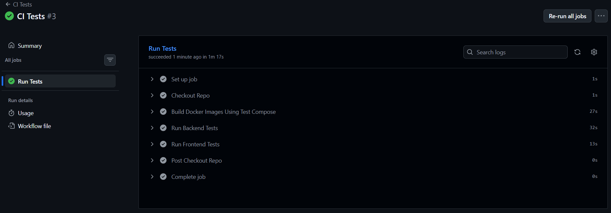

## Build and Push Workflow

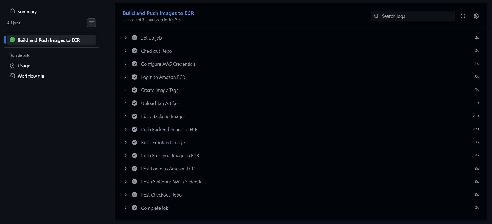

## Deploy Workflow

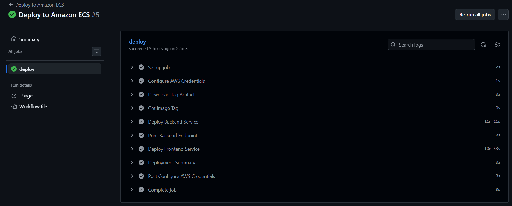

## AWS Configuration

### Running Cluster

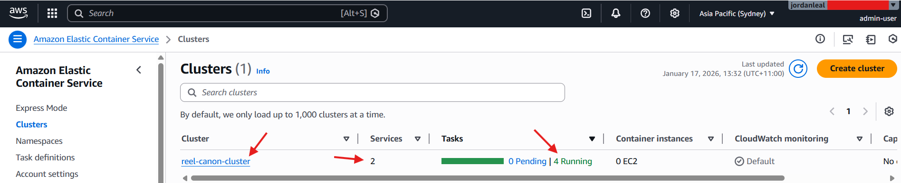

### Running Services

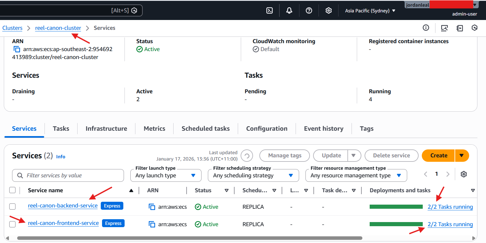

### Backend Service Configuration

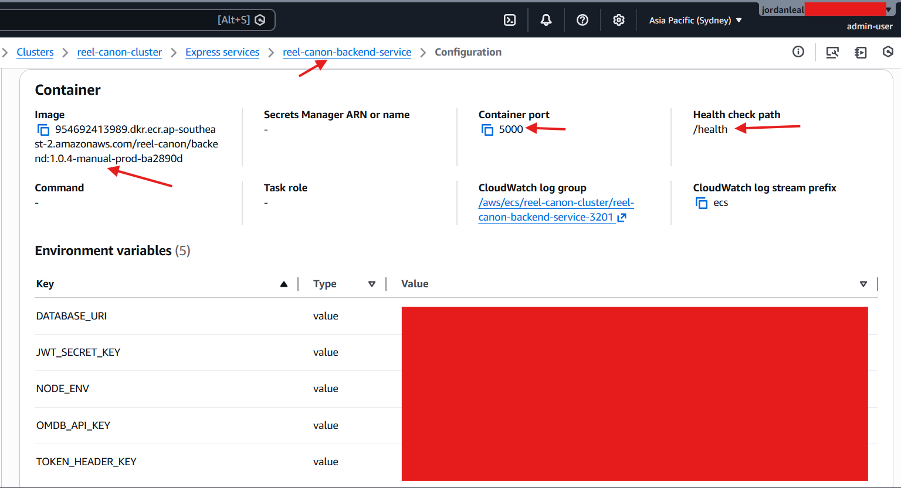

### Frontend Service Configuration

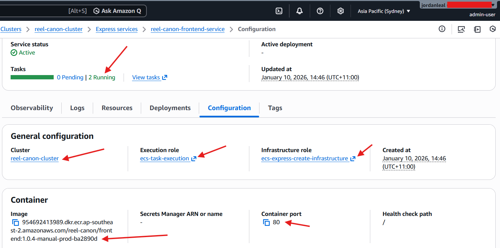

### VPC Resource Map

The private subnets and route table are not used in this application

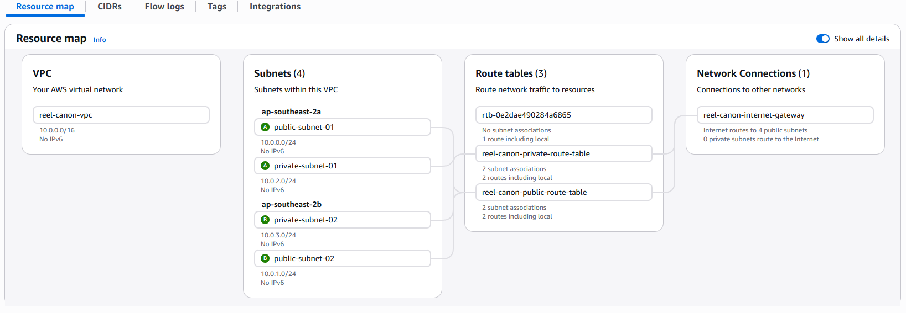

### Images Stored and Pulled From ECR

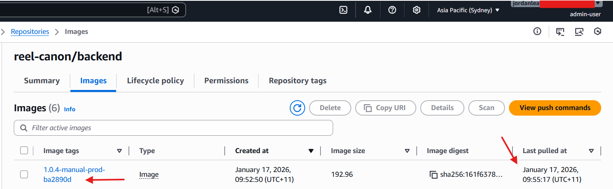

## Website Function

### ALB URL Shows Running Application

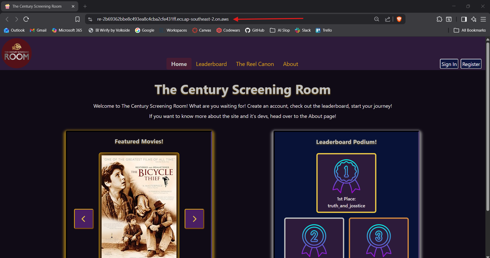

### Persistent Data Loaded From Database

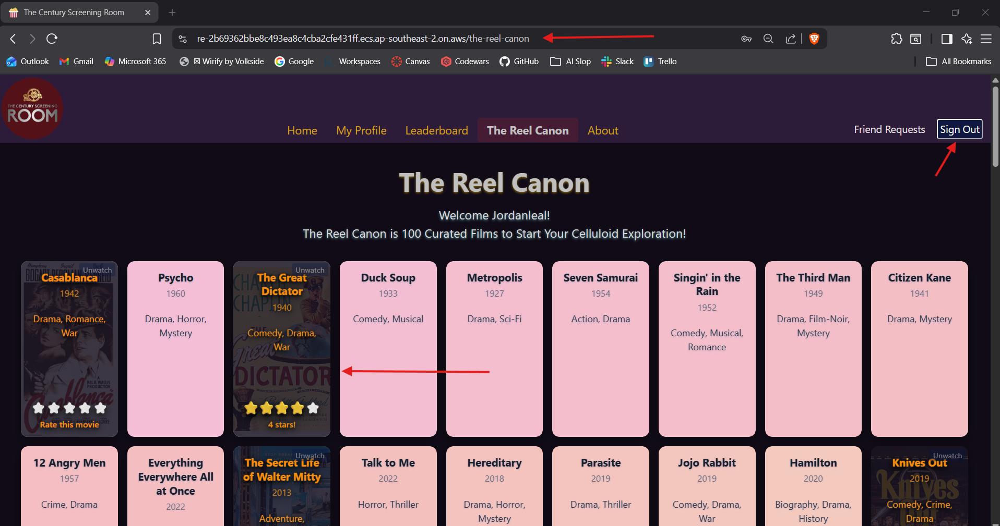
